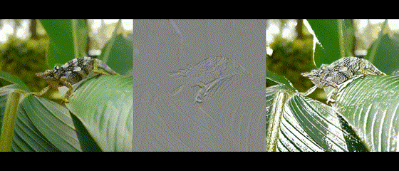

# motion-extraction

## About
This is a C++ implementation of YouTuber Posy's [motion extraction method](http://www.youtube.com/watch?v=NSS6yAMZF78) using OpenCV. It works by playing the video and a duplicate of the video at the same time. This duplicate is inverted and offset by a user-defined number of frames, which leaves only the moving parts of the video visible. Shorter offsets show fast changes, while longer offsets show slower ones. This program currently supports the basic motion extraction as well as overlaying the isolated motion on top of the base video.  
> I have only tested this program on a RaspberryPi 3B+ (for a class project), and it can take quite a while to run. Better hardware should have no trouble running this program.

  
Comparison of original video (left), basic motion extraction (center), and overlay (right). The high quality videos can be found in the `extras` folder.

> "[Two-Horned Chameleon](https://commons.wikimedia.org/wiki/File:Two-Horned_Chameleon.webm)" by [Raoul Kopacka](https://vimeo.com/raoulkopacka) is licensed under [CC BY 3.0](https://creativecommons.org/licenses/by/3.0/) / Cropped and trimmed from original video

## Requirements
This project has only two requirements:
- [OpenCV](https://github.com/opencv/opencv)
- [CMake](https://cmake.org/)
```bash
sudo apt install libopencv-dev cmake
```

## Building
```bash
git clone https://github.com/Slangborgh16/motion-extraction.git
cd motion-extraction
cmake .
make
```

## Positional Arguments
|**Argument**|**Description**|
|---|---|
|Input Path|Path to the input video **(Only supports MP4)**|
|Output Path|Path to save output video to **(Only supports MP4)**|

## Options
|**Option**|**Description**|**Required**|
|---|---|---|
|-f, --frames|Number of frames to offset video by|Yes (Unless `-s` is provided)|
|-s, --seconds|Number of seconds to offset video by|Yes (Unless `-f` is provided)|
|-o, --overlay|Overlay the extracted motion over original video|No|
|-h, --help|Display the help message|No|

`--frames` and `--seconds` are mutually exclusive options. Only use one or the other.  
Setting either `--frames` or `--seconds` to 0 will show changes over the course of the whole video.

## Usage Examples
Extract motion with a 1 second offset:
```bash
./MotionExtraction extras/chameleon.mp4 output.mp4 -s 1
```

Extract motion with a 2 frame offset and enable overlay:
```bash
./MotionExtraction extras/chameleon.mp4 output_overlay.mp4 -f 2 -o
```
